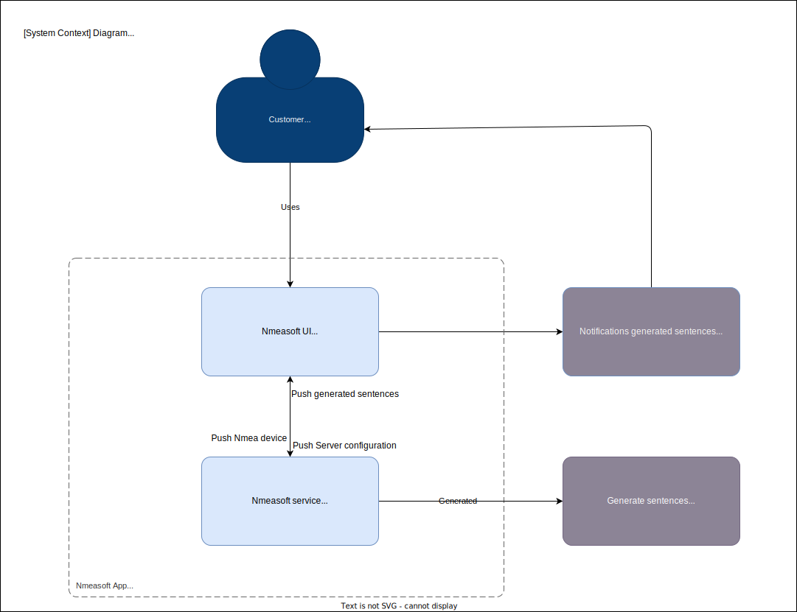
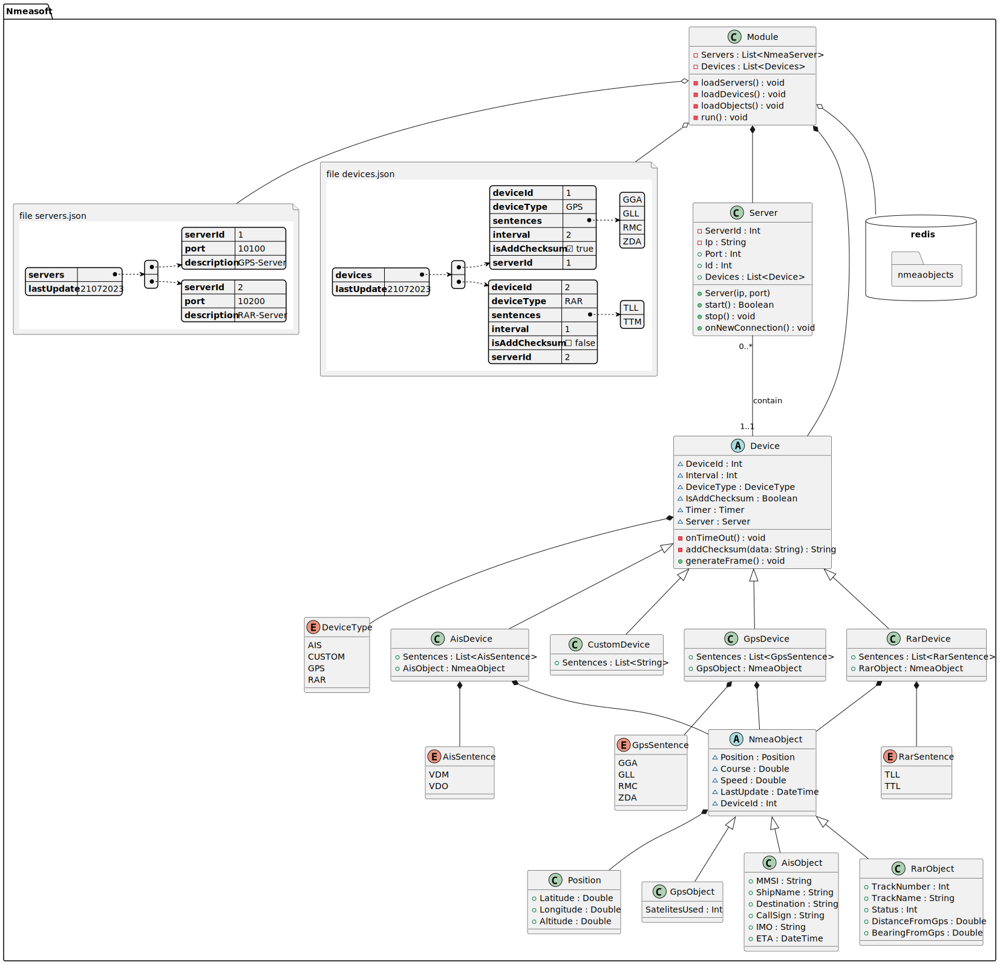

# Nmeasoft-docs

Documentation of the Nmeasoft App.

# Table of Contens

- [Overview](#overview)
- [Instalation](#instalation)
- [Software and Extensions](#software)
  - [Visual Studio Code](https://code.visualstudio.com/)
  - [Drawio Extension](https://app.diagrams.net/)
  - [PlantUML Extension](https://plantuml.com/)

# Overview

Nmeasoft docs is a set of documents that represent the analysis for the implementation of a nmea sentence simulator.
For this purpose I use two paradigms
  - [The C4 Model](https://c4model.com/)
  - [Class Diagram of UML](https://www.visual-paradigm.com/guide/uml-unified-modeling-language/what-is-uml/)

In addition, for implementation I used visual studio code with some extensions that I detailed in the installation process.

# Instalation

Download the repository on your local machine and load it in visual studio code. 

In the packages option install the extension [draw.io.integration](https://marketplace.visualstudio.com/items?itemName=hediet.vscode-drawio). Select the .drawio file and the context diagram of the Nmeasoft App will appear.



In the packages option install the extension [plantUML](https://marketplace.visualstudio.com/items?itemName=jebbs.plantuml). Select the .puml file and you will see the sintax of the class package to the Nmea service implementation identified in the context diagram. 

In order to see the image build in real time, you must install the Java JDK 11 or superior and graphviz package. 

For Arch Linux used

```bash
sudo pacman -S graphviz
```

Finally you will see the image build in real time while you create the diagram class. 



**It is important to mention that any programming language can be used for its coding. In a next stage, I will develop it using Qt wiht C++ for this module.**

# Software

- **[Visual Studio](https://code.visualstudio.com/)**
- **[Drawio Extension](https://app.diagrams.net/)**
- **[PlantUML Extension](https://plantuml.com/)**
